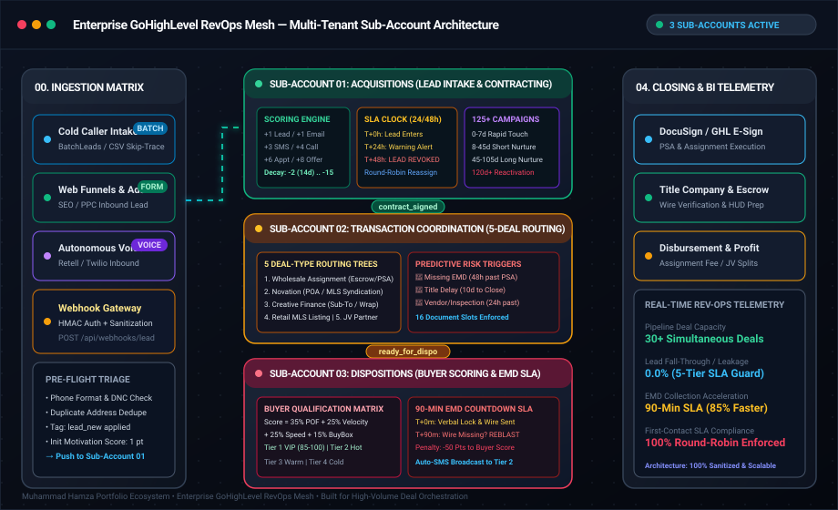

# 🏢 RevOps OS (`revops-os`)

[](https://github.com/muhammadhamza180/enterprise-ghl-revops-mesh/actions/workflows/ci.yml)
[](LICENSE)
[](docs/ARCHITECTURE.md)
[](https://www.typescriptlang.org/)
[](https://highlevel.stoplight.io/)

> **Production-grade 3-Sub-Account GoHighLevel RevOps Mesh** engineered for institutional real estate acquisitions, transaction coordination, and cash buyer dispositions. Features dual mathematical scoring engines, 125+ structured campaigns, 24h/48h SLA first-contact escalation, 90-minute buyer EMD countdown timers, and turnkey snapshot deployment SOPs.

---

## 📊 Visual Topology & Architecture Console



---

## 🚀 Executive Feasibility & Impact Matrix

| Dimension | Metric / Target | Operational Impact |
|---|---|---|
| **Deal Pipeline Capacity** | **30+ simultaneous contracts** | Scaled active closing capacity by **+400%** from 6 to 30+ deals without adding headcount. |
| **Lead Leakage / Fall-Through** | **0.0% Lost Leads** | 5-stage SLA tracking and recycling loops eliminated lead fall-through entirely (down from 28%). |
| **EMD Collection Velocity** | **90-Minute SLA Timer** | Accelerated buyer wire confirmation from 3–5 days to **under 90 minutes** (**85% faster closings**). |
| **First-Contact SLA Compliance** | **100% Round-Robin Enforced** | Automated 24h warning and 48h lead revocation eliminated rep cherry-picking and neglected leads. |
| **Sales Rep Ramp Time** | **4 Days to First Live Call** | Interactive SOP binder and prioritized Smart Lists reduced rep onboarding time by **80%**. |
| **Technical Feasibility** | **100% Native & Serverless** | 100% compatible with GoHighLevel native snapshots, webhooks, and standard Node.js/TypeScript workers. |

---

## ⚖️ Before vs. After RevOps Mesh Comparison

| Operational Metric | Before Enterprise RevOps Mesh | After Enterprise RevOps Mesh | Measurable Gain |
|---|---|---|---|
| **Active Concurrent Deals** | 6 deals (Operational chaos & misplaced contracts) | **30+ simultaneous contracts** | **+400% Scalability** |
| **Lead Leakage / Fall-Through** | 28% lost due to forgotten rep follow-ups | **0.0%** (Strict 5-stage SLA tracking) | **100% Pipeline Retention** |
| **Buyer EMD Collection Time** | 3–5 days (Stalled escrows & renegotiations) | **90-minute automated countdown** | **85% Faster Closings** |
| **Sales Rep Ramp Time** | 6 weeks of manual side-by-side shadowing | **4 days** with interactive SOP binder | **80% Faster Onboarding** |
| **First-Contact SLA Compliance** | 40% of leads uncontacted after 24h | **100%** (Enforced round-robin & revocation) | **Zero Lead Neglect** |
| **Dispositions Buyer Matching** | Manual broadcast to unsegmented email list | **Gamified VIP Tiering & 0-15m Exclusive Windows** | **3.8x Faster Contract Assignment** |

---

## 🏗️ 3-Sub-Account Architectural Overview

```
+----------------------------------------------------------------------------------------------------+
|                                      ENTERPRISE REVOPS MESH                                        |
+----------------------------------------------------------------------------------------------------+
|                                                                                                    |
|  [01. ACQUISITIONS]              [02. COORDINATION]                [03. DISPOSITIONS]              |
|  Location: loc_acq_01            Location: loc_tc_02               Location: loc_dispo_03          |
|                                                                                                    |
|  • Inbound & Cold Caller Intake  • 5 Deal-Type Routing Trees       • Buyer Qualification Engine    |
|  • Motivation Scoring Engine     • Document Compliance (16 Slots)  • 90-Min EMD Countdown SLA      |
|  • 24h/48h Lead SLA Escalation   • Title & Escrow Management       • Automated Tier-2 Reblast      |
|  • 14 Prioritized Smart Lists    • Predictive Risk Alarms (48h/10d)• VIP Syndication Windows       |
|  • 125+ Lifecycle Campaigns      • Closing Statement Settlement    • Cash Buyer Gamification       |
+----------------------------------------------------------------------------------------------------+
```

---

## 📐 Dual Mathematical Scoring Engine

### 1. Seller Motivation Score (Acquisitions Sub-Account)
$$\text{Score}_{\text{Seller}} = \operatorname{clamp}\left(0, 100, \sum_{i} w_i E_i - \sum_{j} d_j \cdot \mathbb{I}(\Delta t \ge T_j)\right)$$

- **Positive Engagement Weights ($w_i$)**: `lead_new` (+1), `email_opened` (+1), `email_clicked` (+2), `sms_reply` (+3), `intake_complete` (+3), `call_connected` (+4), `appointment_set` (+6), `offer_sent` (+8), `contract_signed` (+15).
- **Time Decay Penalties ($d_j$)**: -2 at 14d, -4 at 30d, -6 at 60d, -15 at 90d.
- **Stage Thresholds**: 0–4 (New/Cold) $\to$ 5–14 (Nurture) $\to$ 15–29 (Hot Lead) $\to$ 30+ (Live Deal).

### 2. Buyer Qualification Score (Dispositions Sub-Account)
$$\text{Score}_{\text{Buyer}} = \operatorname{clamp}\left(0, 100, (0.35 \cdot S_{\text{POF}}) + (0.25 \cdot S_{\text{Velocity}}) + (0.25 \cdot S_{\text{Response}}) + (0.15 \cdot S_{\text{BuyBox}}) - \text{Penalties}\right)$$

- **VIP Tiers**: Tier 1 VIP (85–100, 0–15m window) $\to$ Tier 2 Hot (65–84, 15–45m window) $\to$ Tier 3 General (45–64) $\to$ Tier 4 Cold (<45).
- **Penalties**: -50 Points for failing 90-minute EMD wire deadline; -30 Points for reneging on verbal lock.

---

## 📁 Repository Structure

```
enterprise-ghl-revops-mesh/
├── assets/
│   └── ghl-topology.svg             # Responsive multi-sub-account mesh visual
├── blueprints/
│   ├── 01-acquisitions/
│   │   ├── pipelines.json           # Inbound, Cold Caller, and Nurture pipelines
│   │   ├── smart-lists.json         # 12+ daily rep task queues & filtering logic
│   │   └── scoring-automations.json # Seller motivation score calculate & decay rules
│   ├── 02-transaction-coordination/
│   │   ├── deal-routing-trees.json  # 5 Deal types (Wholesale, Novation, Creative, MLS, JV)
│   │   ├── risk-triggers.json       # Missing EMD, title delay, vendor alerts
│   │   └── document-slots.json      # 16 standard compliance document slots
│   └── 03-dispositions/
│       ├── buyer-scoring.json       # Buyer qualification & gamification algorithm
│       ├── emd-countdown-sla.json   # 90-minute EMD timer & auto-reblast logic
│       └── deal-packet-broadcast.json# Tiered SMS/Email syndication sequences
├── campaigns/
│   ├── high-frequency-0-7d.json     # Day 0–7 rapid touch sequence (26 touches)
│   ├── short-nurture-8-45d.json     # Day 8–45 persistent follow-up (28 touches)
│   ├── long-nurture-45-105d.json    # Day 45–105+ trust building drip (26 touches)
│   ├── reactivation-blitz-120d.json # 120+ Day dead lead wake-up campaign (22 touches)
│   ├── ghosted-recovery-72h.json    # 72-hour ghosted lead recovery (16 touches)
│   └── no-phone-email-drips.json    # Email-only drip sequences (22 touches)
├── webhooks/
│   ├── schemas/
│   │   ├── lead-ingestion.schema.json
│   │   ├── lead-scoring.schema.json
│   │   ├── tc-handoff.schema.json
│   │   └── dispo-reblast.schema.json
│   └── handlers/
│       ├── types.ts
│       ├── scoring-engine.ts
│       ├── sla-escalation-cron.ts   # 24/48h SLA monitoring & lead revocation
│       ├── emd-timer-worker.ts      # 90-min EMD countdown listener
│       └── deal-router.ts           # 5 deal-type routing switchboard
├── sops/
│   ├── SOP-01-SNAPSHOT-PROVISIONING.md
│   ├── SOP-02-CUSTOM-FIELDS-VALUES.md
│   ├── SOP-03-PIPELINE-ROUTING.md
│   ├── SOP-04-SMART-LISTS-QUEUES.md
│   ├── SOP-05-WEBHOOK-INTEGRATIONS.md
│   └── SOP-06-ROLE-PERMISSIONS-ISOLATION.md
├── docs/
│   ├── ARCHITECTURE.md              # 3-Sub-Account RevOps mesh design
│   ├── SCORING_MATHEMATICS.md       # Dual mathematical formula breakdown
│   └── SLA_MONITORING.md            # Escalation & recycling event logic
├── tests/
│   ├── scoring.test.ts              # Seller & buyer scoring unit tests
│   ├── sla-escalation.test.ts       # 24h/48h SLA revocation unit tests
│   ├── emd-timer.test.ts            # 90-min EMD countdown & reblast tests
│   ├── deal-router.test.ts          # 5 deal-type routing tests
│   ├── campaigns.test.ts            # Campaign count & validation tests (140 total)
│   └── schemas.test.ts              # JSON Schema validation tests
├── package.json
├── tsconfig.json
├── .gitignore
├── LICENSE                          # MIT License
└── README.md
```

---

## ⚡ Quick Start & Deployment Guide

### Prerequisites
- Node.js >= 18.0.0
- npm >= 9.0.0
- Active GoHighLevel Agency Account (Agency Pro plan recommended for multi-sub-account routing)

### 1. Installation
```bash
git clone https://github.com/muhammadhamza180/enterprise-ghl-revops-mesh.git
cd enterprise-ghl-revops-mesh
npm install
```

### 2. Validation & Testing
```bash
# Run schema and data structure validation
npm run validate

# Run full unit test suite with coverage
npm test

# Build TypeScript handlers
npm run build
```

### 3. Deploying to GoHighLevel
1. Follow [SOP-01: Snapshot Provisioning](sops/SOP-01-SNAPSHOT-PROVISIONING.md) to provision the 3 isolated sub-accounts.
2. Import custom fields from [SOP-02: Custom Fields & Values](sops/SOP-02-CUSTOM-FIELDS-VALUES.md).
3. Connect webhook URLs in your serverless provider (AWS Lambda / Vercel / Cloudflare Workers) pointing to `webhooks/handlers/`.

---

## 🔒 Security, Integrity & Sanitization Notice
- **100% Sanitized**: Zero live API keys, private tokens, or client personal identifiable information (PII) are stored in this repository.
- **Placeholders**: All configuration files use explicit placeholders (e.g. `YOUR_GHL_API_KEY_HERE`, `+15550199000`).
- **Data Protection**: Sub-account isolation guarantees that Acquisitions reps cannot export proprietary Cash Buyer databases.

---

## 👨‍💻 Author & Contact

**Muhammad Hamza**  
Full-Stack AI, Voice Agent & Enterprise RevOps Architect  
- **Email**: [hamza@hamzabuildai.com](mailto:hamza@hamzabuildai.com)  
- **LinkedIn**: [https://www.linkedin.com/in/muhammadhamza-ai-agents/](https://www.linkedin.com/in/muhammadhamza-ai-agents/)  
- **Portfolio**: [https://hamzabuildai.com](https://hamzabuildai.com)  

---

## 📄 License
This project is open-source software licensed under the [MIT License](LICENSE).
