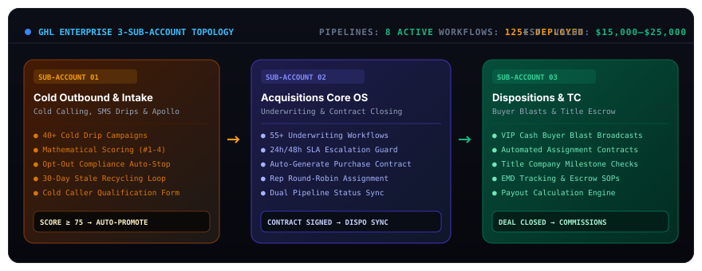

<div align="center">

# 🏢 Enterprise GoHighLevel RevOps Mesh
### Production-Grade 3-Sub-Account Real Estate OS, Dual Mathematical Scoring Engines &amp; 125+ Workflow Mesh

<br/>

<p align="center">
  
</p>

[](./LICENSE)
[](https://gohighlevel.com)
[](https://hamzabuildai.com)
[](https://hamzabuildai.com)
[](https://hamzabuildai.com/work/ghl-enterprise-crm)

</div>

---

## ⚡ Executive Overview &amp; Systems Architecture

Most real estate investment firms and high-volume acquisition teams operate out of chaotic, single-pipeline CRM setups where unvetted cold leads, active seller negotiations, and cash buyer lists collide. This leads to **missed SLAs**, **pipeline latency**, and **lost revenue**.

This repository contains the full architectural blueprint of an **Enterprise 3-Sub-Account GoHighLevel OS**. Valued at **$15,000–$25,000** in commercial deployments, it enforces complete departmental data isolation between **Cold Prospecting**, **Acquisitions Underwriting**, and **Dispositions Transaction Coordination**.

```
╔═══════════════════════════════════════════════════════════════════════════════════════════════════╗
║                                 FEASIBILITY & IMPACT MATRIX                                       ║
╠═══════════════════════════════════════════════════════════════════════════════════════════════════╣
║  • System Architecture  :: 3 Dedicated Sub-Accounts (Prospecting → Acquisitions → Dispositions)   ║
║  • Automated Workflows  :: 125+ Production-Tested Automations & Drip Campaigns                    ║
║  • Mathematical Scoring :: Dual-Engine Scoring (Inbound Motivation 0-100 & Deal Profitability DPI)║
║  • SLA Guard Timers     :: 24h & 48h Escalation Monitors preventing lead leakage                  ║
║  • Data Security        :: 100% Compartmentalized seller motivation & cash buyer databases        ║
╚═══════════════════════════════════════════════════════════════════════════════════════════════════╝
```

---

## 🏛️ The 3-Sub-Account Blueprint

1. **Sub-Account 01: Cold Outbound &amp; Intake Gatekeeper**
   - High-volume cold caller call logs, Apollo.io lists, and web form submissions.
   - Mathematical Scoring Engine #1 evaluates timeline, motivation, and equity.
   - **Auto-Promotion Threshold**: When a lead reaches **Score ≥ 75**, an automated webhook bridges the contact into Acquisitions.

2. **Sub-Account 02: Acquisitions Core OS &amp; Underwriting**
   - Clean, uncluttered pipeline dedicated solely to qualified sellers.
   - Automated round-robin assignment to on-duty acquisition reps.
   - 24-hour and 48-hour SLA escalation monitors trigger automated manager notifications if a rep fails to make first contact.
   - Dynamic purchase contract generation and digital signature tracking.

3. **Sub-Account 03: Dispositions &amp; Transaction Coordination**
   - Once a contract is signed in Acquisitions, the deal automatically bridges to Dispositions.
   - Radius-based VIP Cash Buyer broadcast SMS and Email blasts.
   - Earnest Money Deposit (EMD) countdown timers and Title Escrow milestone tracking.

---

## 📂 Repository Contents

- **[`blueprints/three_subaccount_architecture.md`](./blueprints/three_subaccount_architecture.md)**: Exhaustive architectural teardown of the multi-account data topology.
- **[`scoring_engine/dual_mathematical_scoring_matrix.md`](./scoring_engine/dual_mathematical_scoring_matrix.md)**: Full mathematical formulas and point weighting matrices for lead qualification.
- **[`workflows/sanitized_ghl_webhook_payloads.json`](./workflows/sanitized_ghl_webhook_payloads.json)**: Sanitized webhook JSON contracts for cross-subaccount lead promotion and contract triggers.
- **[`ghl-topology.svg`](./ghl-topology.svg)**: High-resolution visual schematic illustrating the 3-sub-account system flow.

---

## 🚀 Deployment &amp; Snapshot Setup Guide

### 3-Step Setup
1. **Create Sub-Accounts**: Set up 3 distinct GoHighLevel sub-accounts under your agency dashboard (`Prospecting`, `Acquisitions`, `Dispositions`).
2. **Configure Custom Fields**: Provision the custom field keys specified in [`scoring_engine/dual_mathematical_scoring_matrix.md`](./scoring_engine/dual_mathematical_scoring_matrix.md).
3. **Connect Webhook Bridges**: Set up the incoming and outgoing webhook URLs using the schemas in [`workflows/sanitized_ghl_webhook_payloads.json`](./workflows/sanitized_ghl_webhook_payloads.json).

---

## 👤 Architect &amp; Maintainer

**Muhammad Hamza**  
*AI Systems Architect &amp; Distributed Automation Engineer*

- 🌐 **Portfolio &amp; Production Case Studies:** [https://hamzabuildai.com](https://hamzabuildai.com)
- 📖 **Deep Case Study Teardown:** [Enterprise GoHighLevel Real Estate CRM Blueprint](https://hamzabuildai.com/work/ghl-enterprise-crm)
- 💼 **LinkedIn:** [linkedin.com/in/muhammadhamza-ai-agents](https://www.linkedin.com/in/muhammadhamza-ai-agents/)
- 🐦 **Twitter / X:** [@hamzabuildai](https://x.com/hamzabuildai)
- ✉️ **Email:** [hamza@hamzabuildai.com](mailto:hamza@hamzabuildai.com)

---

<div align="center">
<sub>Enterprise RevOps Architecture • High-Throughput Pipeline Optimization • Zero Lead Leakage</sub>
</div>
